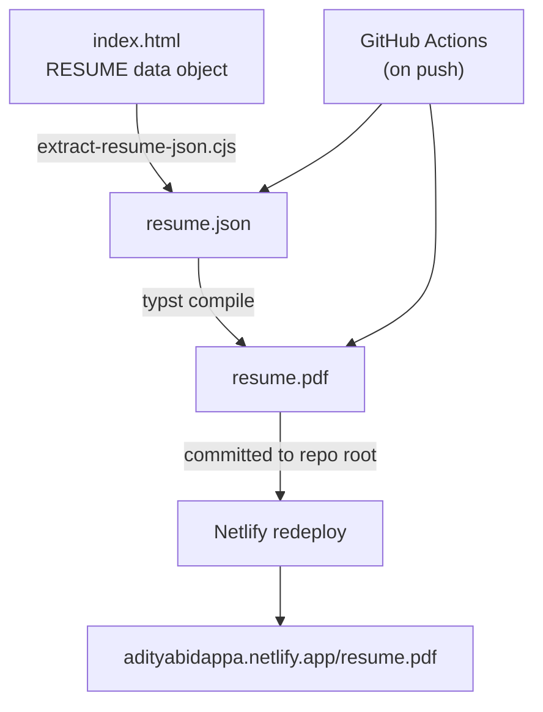

# Aditya Bidappa M V — Résumé

**Live site:** https://adityabidappa.netlify.app/
**Résumé PDF (always current):** https://adityabidappa.netlify.app/resume.pdf

This is a self-hosted, hand-built résumé site with no framework and no build step. It's paired with a pipeline that generates a separate, ATS-safe PDF from the exact same content — so the interactive site and the downloadable PDF can never drift out of sync. All content lives in one place: the `const RESUME = {...}` object in `index.html`.

---

## Architecture



The site and the PDF are deliberately different documents from the same source data — not a screenshot of each other. The interactive site is designed for browsing: dark theme, animations, command palette, section navigation. The PDF is designed for ATS parsing and printing: linear layout, plain text, machine-readable structure. The pipeline ensures both are always derived from exactly the same `RESUME` object, so updating one line in `index.html` updates both formats on the next push.

---

## Tech stack

- **Site** — vanilla HTML, CSS, and JavaScript; zero dependencies, no build step
- **Extraction** — Node.js built-ins only (`vm`, `fs`, `path`); no npm packages
- **PDF typesetting** — [Typst](https://typst.app/)
- **Automation** — GitHub Actions
- **Hosting** — Netlify (continuous deploy from `main`)

---

## Repository structure

```
.
├── index.html                          # The site — edit RESUME here
├── resume.pdf                          # Generated PDF — do not edit manually
├── pdf-pipeline/
│   ├── extract-resume-json.cjs         # Extracts RESUME object → resume.json
│   ├── resume.typ                      # Typst template for the PDF
│   ├── resume.json                     # Generated; committed for CI caching
│   └── fonts/
│       ├── JetBrainsMono-Regular.ttf
│       ├── JetBrainsMono-Medium.ttf
│       └── JetBrainsMono-Bold.ttf
├── .github/workflows/
│   └── build-resume-pdf.yml            # Runs extractor + Typst on every push
├── scripts/
│   └── pre-commit-check.sh             # Install to .git/hooks/pre-commit
└── README.md
```

---

## Updating content

Edit the `RESUME` object inside `index.html`, commit, and push. The GitHub Action runs automatically and commits the regenerated `resume.pdf` back to the repo, which triggers a Netlify redeploy.

---

## Local development

Regenerate the PDF without waiting for CI:

```bash
node pdf-pipeline/extract-resume-json.cjs index.html pdf-pipeline/resume.json
typst compile pdf-pipeline/resume.typ resume.pdf --font-path pdf-pipeline/fonts
```

Both commands must exit 0 before committing any change that touches the `RESUME` object.

---

## Pre-commit hook

The `scripts/pre-commit-check.sh` hook blocks commits that accidentally contain secrets or unwanted text. Install it once per clone:

```bash
cp scripts/pre-commit-check.sh .git/hooks/pre-commit
chmod +x .git/hooks/pre-commit
```
